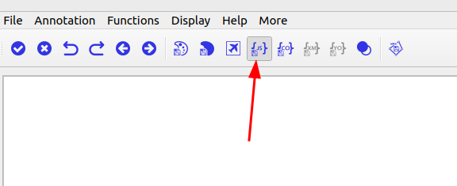

# Prius2audioscene

## Acknowledgment

This code is adapted from the ROSBAG2NUSCENES project developed by TUM 

## Description


This codebase converts ROS 2 bag files to the nuScenes dataset format (.jpeg and .pcd).

It requires a valid ROS 2 bag file, information about the scene in the bag file, and the nuScenes JSON files to copy. The `config.yaml` file will be automatically generated based on the topic information in the bag files. Only the information about the nuScenes JSON files needs to be changed manually if needed (by default `examples/v1.0-test/category.json` is already set). There is a Dockerfile provided to create an image with all necessary dependencies to run the converter.


# Clone this repo

```
 git clone git@gitlab.tudelft.nl:intelligent-vehicles/autoware_iv.git
```

## Open it in VScode

Now that you have the repo, you can open it in VS code VSCode (File->Open Folder).


### Note on env variables:

The code uses different env variables. You need to set them in the `.devcontainer/devcontainer.json` 
```json
		"CAM_FRONTCENTER_TYPE": "image_raw",
		"CAM_SECONDARY_TYPE": "image_raw",
		"CONFIG_PATH" : "${containerWorkspaceFolder}/config/config.yaml",
		"SCENE_NAME" : "ros2_output"
```
### Note on mounted volumes:

By default only the root of the workspace is mounted. If you want to mount different folders, for instance for the rosbags or the output, you need to change them in the `.devcontainer/devcontainer.json` file and re-build the image.

## Open in a container inside vscode.

After you set the correct values mentioned before hen you open you can open the project in a container.

You should see a little popup that asks you if you would like to open it in a container. Say yes!

If you don't see the pop-up, click on the little blue square in the bottom left corner, which should bring up the container dialog

In the dialog, select _Reopen in container_

VSCode will build the dockerfile inside of `.devcontainer` for you.  If you open a terminal inside VSCode (Terminal->New Terminal).

You should see that your username has been changed to `vscode`, and the bottom left blue corner should say "Dev Container".

You can read more information about VS Code and containers here <https://code.visualstudio.com/docs/devcontainers/containers>


## Use without vscode

You can also use this code without the vscode environment, for that you need to build the docker image locally and then run it with the correct mount points and env variables.

### Create Docker image

```
./docker-build.sh
```

### Run docker image

1. Modify the variables in the `docker-run.sh` file accordingly

```bash
# Define the image name
IMAGE_NAME="Prius2audioscene:latest"
SCENE_NAME="ros2_output"
CAM_FRONTCENTER_TYPE=image_raw
CAM_SECONDARY_TYPE=image_raw

# Define the path on the host to the folder with bags
HOST_BAG_PATH="/media/mario/LaCie/rosbags_prius"
HOST_NUSCENES_PATH="/media/mario/LaCie/nuscenes_converted/output"
```
2. Run the docker image with

```
./docker-run.sh
```

It will open a `bash` terminal where you can run all the scripts in this project.

### Extract files from bag


1. Modify the .env file according to your needs:

```
HOST_BAG_PATH=/home/ge48vus/datasets/rosbags/campus # Where the rosbags (folders) are located In this example, inside campus there is rosbag1/, rosbag2/ ....
SCENE_NAME=rosbag2_2024_10_15-15_47_23 # Name of the rosbag inside $HOST_BAG_PATH you want to process
HOST_NUSCENES_PATH=/home/ge48vus/datasets/nuscenes_format/ # Folder where you want to save the processed scene. Inside this folder a $SCENE_NAME folder will be created

```
2. 

```
docker compose up edgar2nuscenes
```
After the process completes, you will find the converted data in the output folder in <HOST_NUSCENES_PATH>/<SCENE_NAME>.

3. After running the pseudolabeling pipeline, create a folder inside <HOST_NUSCENES_PATH>/<SCENE_NAME> called labels and paste the resulting label pkl file there, then:
```
docker compose up annotations2nuscenes
```

Now you have the pseudolabels in nuscenes format.

4. To add new scenes to your existing edgarScenes data:
```
python3 utils/add_scene.py <edgarScenes absolute path> <new scene absolute path>
ex python3 utils/add_scene.py /Users/estebanrivera/Work/EDGAR/edgarScenes /Users/estebanrivera/Work/EDGAR/nuscenes_format/2024_10_25_garching_labeling_005
```
5. To merge multiple scenes into one nuscenes-like dataset
```
python utils/merge_scenes.py <name of merged dataset> <location of scenes folder>
python utils/merge_scenes.py edgarScenes /home/esteban/data/nuscenes_format
```
Result will be created in the same folder where the original nuscenes-format scenes are located. In the example in /home/esteban/data/edgarScenes
### Combine multiple bags
The script combines multiple bags within a folder tree. The configuration can be changed in `config/merge_bags_config.yaml`.
```bash
./merge_bags.sh /path/to/bags/folder/
```


After the image is created, set the path to the folder with the bag files to convert in `run.bash`. Execute `run.bash` to convert the files. 

### Restrictions

The bag file must contain the frame `camera_basler_frontcenter`. If this reference frame is missing or has a different name, the process will fail.

### Label Images

[Install eiseg](https://github.com/PaddlePaddle/PaddleSeg/blob/release/2.9/EISeg/docs/install_en.md)

[Follow the gide: How to label with Padel](./docs/How_to_label_with_Padel.pdf)

- Save Settings -> only save the json



- Label only Drivable space

### Transfer Image segmentation to lidar
```bash
python3 labels_im2lidar.py
```
